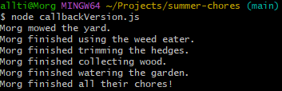

# summer-chores

### Practical Overview: 
An assignment for the Web Development course from Code:You. This assignment dealt in practicing the various methods used in asynchronous Javascript coding. In particular, these are the Callbacks, Promises and Async/Await methods.

### Scenario Overview: 
Someone has a list of summer chores they have to do every Saturday. There are a lot of chores for them to do and naturally get more tired throughout completing their tasks. If they get too tired, they may fall asleep before completing all their chores.

They have a strict routine, which follows in order:

    1. Mowing the yard
    2. Weedeating the edges of the house and fence line
    3. Trimming the hedges
    4. Collect fallen wood for summer night fires
    5. Water the garden

If they manage not to get tired and fall asleep while doing their chores, they have successfully completed their chores. Also, there's never a chance of the person falling asleep before mowing the yard.

## Table of Contents
| **File** | **Description** |
| -------- | ----------------|
| asyncAwaitVersion.js | This file plays out the scenario using the Async/Await functions method for asynchronous JavaScript. |
| callbackVersion.js | This file plays out the scenario using the Callback Function method for asynchronous JavaScript. |
| promiseVersion.js | This file plays out the scenario using the Callback Function method for asynchronous JavaScript. |

## How to Download/Use
1. Download Git and Node.js
    A. Git Download
        1. Go to the official Git website for downloads: https://git-scm.com/install/.
        2. Click the version applicable to your Operating System. From there, you can click the link provided upmost for downloading.
        3. Open the Git installer and run through the setup pop-ups.
            Note: You can simply hit next through most of the process. It is recommended to select "Additional icons" when on the Select Components tab however, along with selecting "Override the default branch name for new repositores" on the name adjustments for repositories tab.
        4. You can test if your download is successful by either opening up the Command Prompt for your OS. From there, you can type in ``git``. If it returns the list of commands and usage details for it, your download was successful!
    B. Node.js Download
        1. Go to the official Node.js website for downloads: https://nodejs.org/en.
        2. Open the Node.js installer and run through the setup pop-ups.
            Note: You can simply hit next through most of the process. Do not mess with any of the options unless you know what you are doing.
        3. You can test if your download is successful by either opening up the Command Prompt for your OS, or any other Command Consoles you might have (i.e. Git). From there, you can type in ``node --version``. If it returns the current version, your download was successful!

2. Open up Git and clone the repository.
    Note: It is recommended to set up a 'Projects' folder beforehand, using the "mkdir" command on your root directory.
    ``git clone https://github.com/knighmor/summer-chores.git``

3. Navigate to the project directory.
    ``cd summer-chores``

4. Use the following commands in Git depending on the file you wish to run.
    A. To run the *asyncAwaitVersion.js* file, use:
        ``node asyncAwaitVersion.js``
    B. To run the *callbackVersion.js* file, use:
        ``node callbackVersion.js``
    C. To run the *promiseVersion.js* file, use:
        ``node promiseVersion.js``

5. At that point, the files should execute-- and you'll have an output that looks something like this! Congrats!
